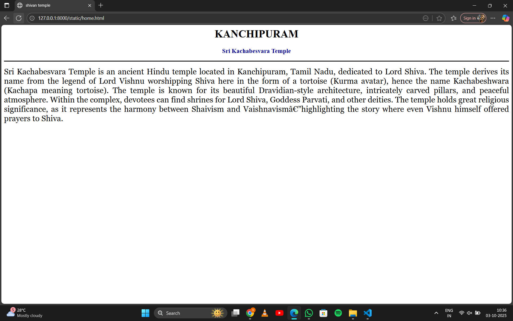
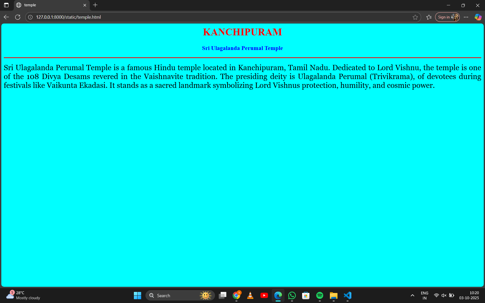

# Ex04 Places Around Me
## Date: 03-10-2025

## AIM
To develop a website to display details about the places around my house.

## DESIGN STEPS

### STEP 1
Create a Django admin interface.

### STEP 2
Download your city map from Google.

### STEP 3
Using ```<map>``` tag name the map.

### STEP 4
Create clickable regions in the image using ```<area>``` tag.

### STEP 5
Write HTML programs for all the regions identified.

### STEP 6
Execute the programs and publish them.

## CODE
```
map.html :

<html>
<head>
<title>My City</title>
</head>
<body>
<h1 align="center">
<font color="red"><b>kanchipuram</b></font>
</h1>
<h3 align="center">
<font color="blue"><b>SANJAY KUMAR (24000581)</b></font>
</h3>
<center>

<map name="MyCity">
<area shape="rect" coords="80,80,300,300" href="home.html" title="SRI KACHABESVARA TEMPLE">
<area shape="circle" coords="570, 230,45" href="hotel.html" title="adayaR ananda bhavan (A2B)">
<area shape="circle" coords="640, 400,100" href="cinema.html" title="KARTHIKEYAN CINEMAS">
<area shape="circle" coords="1120, 360, 250" href="mahal.html" title="SRI ARUNA MAHAL">
<area shape="rect" coords="950, 120, 1100, 150" href="temple.html" title="sri ulagalantha perumal temple">
</map>
</center>
</body>
</html>

home.html :

<html>
<head>
<title>shivan temple</title>
</head>
<body bgcolor="white">
<h1 align="center">
<font color="black"><b>KANCHIPURAM</b></font>
</h1>
<h3 align="center">
<font color="darkblue"><b>Sri Kachabesvara Temple</b></font>
</h3>
<hr size="3" color="black">
<p align="justify">
<font face="Georgia" size="5">
Sri Kachabesvara Temple is an ancient Hindu temple located in Kanchipuram, Tamil Nadu, 
dedicated to Lord Shiva. The temple derives its name from the legend of Lord Vishnu worshipping Shiva 
here in the form of a tortoise (Kurma avatar), hence the name Kachabeshwara (Kachapa meaning tortoise).
The temple is known for its beautiful Dravidian-style architecture, intricately carved pillars, and peaceful atmosphere.
 Within the complex, devotees can find shrines for Lord Shiva, Goddess Parvati, and other deities. The temple holds great religious significance, as it represents 
 the harmony between Shaivism and Vaishnavism—highlighting the story where even Vishnu himself offered prayers to Shiva.
</p>
</body>
</html>

mahal.html :

<html>
<head>
<title>MAHAL</title>
</head>
<body bgcolor="darkmagenta">
<h1 align="center">
<font color="black"><b>KANCHIPURAM</b></font>
</h1>
<h3 align="center">
<font color="darkblue"><b>Sri Aruna Mahal & Residency A/C</b></font>
</h3>
<hr size="3" color="black">
<p align="justify">
<font face="Georgia" size="5">
Sri Aruna Mahal & Residency A/C is a well-known marriage hall and lodging facility in Kanchipuram, 
Tamil Nadu, offering a perfect blend of tradition and modern amenities. The Mahal is spacious, fully air-conditioned, 
and ideal for hosting weddings, receptions, family gatherings, cultural events, and corporate functions.
Along with the banquet hall, it also provides comfortable residency rooms for guests, ensuring convenience for those attending functions. 
The venue is appreciated for its cleanliness, ample parking space, good hospitality, and easy accessibility within the city.
</p>
</body>
</html>

hotel.html :

<html>
<head>
<title>My Home Town</title>
</head>
<body bgcolor="yellow">
<h1 align="center">
<font color="red"><b>KANCHIPURAM</b></font>
</h1>
<h3 align="center">
<font color="blue"><b>Adyar Ananda Bhavan (A2B)</b></font>
</h3>
<hr size="3" color="red">
<p align="justify">
<font face="Georgia" size="5">
Adyar Ananda Bhavan (A2B) is one of South India's
most popular and trusted chains of vegetarian restaurants and sweet shops. 
Founded in Chennai, it has grown into a household name known for its wide variety of authentic South Indian dishes, North Indian delicacies, snacks, sweets, and bakery items. A2B is especially famous for its traditional sweets like Mysore Pak, laddus, and milk sweets, as well as crispy dosas, soft idlis, and flavorful meals.
With a strong emphasis on quality, hygiene, and taste, A2B caters to families, 
travelers, and food lovers across India and abroad. Today, it has outlets not just in 
Tamil Nadu and other Indian states, but also internationally, making it a go-to place for 
anyone craving authentic Indian vegetarian cuisine.
</p>
</body>
</html>

cinema.html:

<html>
<head>
<title>CINEMAS</title>
</head>
<body bgcolor="red">
<h1 align="center">
<font color="cyan"><b>KANCHIPURAM</b></font>
</h1>
<h3 align="center">
<font color="blue"><b>Karthikeyan Cinemas</b></font>
</h3>
<hr size="3" color="black">
<p align="justify">
<font face="Georgia" size="5">
Karthikeyan Cinemas is a popular movie theatre located in Kanchipuram, Tamil Nadu, known for providing quality entertainment to the local community. 
The theatre screens the latest Tamil, Telugu, Hindi, and occasionally English films, making it a go-to spot for cinema lovers in the region.
</p>
</body>
</html>

temple.html

<html>
<head>
<title>temple</title>
</head>
<body bgcolor="cyan">
<h1 align="center">
<font color="red"><b>KANCHIPURAM</b></font>
</h1>
<h3 align="center">
<font color="blue"><b>Sri Ulagalanda Perumal Temple</b></font>
</h3>
<hr size="3" color="red">
<p align="justify">
<font face="Georgia" size="5">
Sri Ulagalanda Perumal Temple is a famous Hindu temple located in Kanchipuram, Tamil Nadu. Dedicated to Lord Vishnu, 
the temple is one of the 108 Divya Desams revered in the Vaishnavite tradition. The presiding deity is Ulagalanda Perumal (Trivikrama), 
of devotees during festivals like Vaikunta Ekadasi. 
It stands as a sacred landmark symbolizing Lord Vishnus protection, humility, and cosmic power.
</p>
</body>
</html>

```

## OUTPUT







## RESULT
The program for implementing image maps using HTML is executed successfully.
